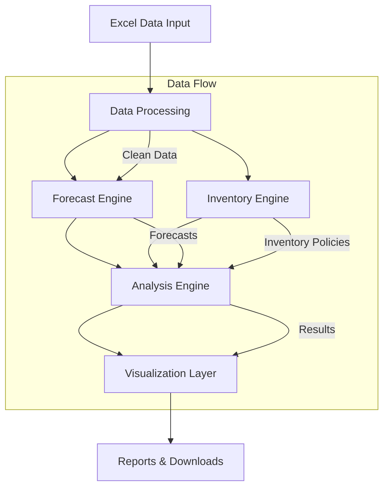
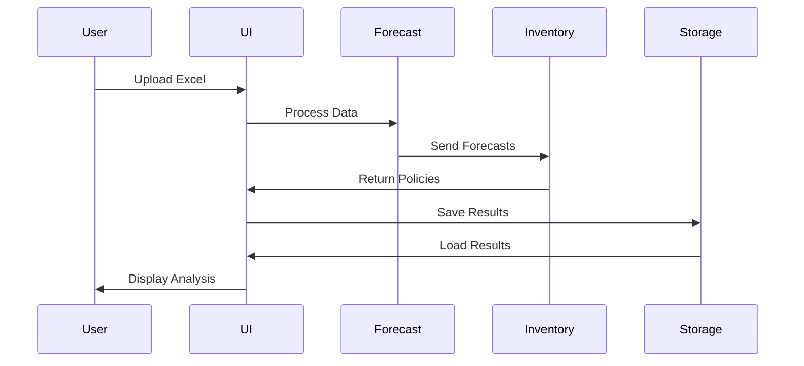

# 📦 Advanced Inventory Management System


## 🎯 Overview

A comprehensive Inventory Management System built with Streamlit, designed for enterprise-level supply chain optimization. The system provides advanced demand forecasting, inventory optimization, and supply chain analytics through an intuitive web interface.

### System Architecture



### Component Interaction


## Features

- **Data Upload**: Easy Excel file upload for SKU data
- **Demand Forecasting**: Multiple forecasting models including Exponential Smoothing, ARIMA, and Normal Distribution
- **Inventory Policy Calculation**: Various inventory models including Periodic Review, Continuous Review, Base Stock, and Newsvendor
- **Interactive Visualizations**: Detailed plots for inventory levels, demand, and various performance metrics
- **Sensitivity Analysis**: Tools to understand how different parameters affect inventory performance
- **Performance Metrics**: Comprehensive set of KPIs including service level, profit, and inventory turnover
- **Supply and Demand Planning**: Visualization and analysis of supply plans and demand forecasts
- **Customizable Parameters**: Adjustable lead times, service levels, costs, and more

## 💻 Installation

### Local Development

  ```bash
  git clone https://github.com/yourusername/inventory-management-system
  cd inventory-management-system
  ```

  ```bash
  python -m venv venv
  source venv/bin/activate  # On Windows: venv\Scripts\activate
  ```

  ```bash
  pip install -r requirements.txt
  ```

### Enterprise Deployment

#### Docker Deployment
  ```dockerfile
  FROM python:3.8-slim

  WORKDIR /app
  COPY . /app

  RUN pip install -r requirements.txt

  EXPOSE 8501

  HEALTHCHECK CMD curl --fail http://localhost:8501/_stcore/health

  ENTRYPOINT ["streamlit", "run", "Home.py", "--server.port=8501", "--server.address=0.0.0.0"]
  ```

## Running the Application

To run the Streamlit app, use the following command in your terminal:

```
streamlit run app.py
```

The application will open in your default web browser.

## How to Use

1. **Upload Data**: Start by uploading your SKU data in Excel format. The file should contain columns for SKU, Date, and Quantity.

2. **Select SKU**: Choose the specific SKU you want to analyze from the dropdown menu.

3. **Set Parameters**: Adjust various parameters such as lead time, service level, and costs according to your business needs.

4. **Choose Models**: Select your preferred forecasting and inventory models.

5. **Run Simulation**: Click the "Run Simulation" button to generate forecasts and inventory policies.

6. **Analyze Results**: Navigate through different tabs to view forecasts, inventory levels, performance metrics, and more.

7. **Sensitivity Analysis**: Use the sensitivity analysis tool to understand how changes in parameters affect your inventory performance.

8. **Download Results**: Export your results and updated policies for further analysis or implementation.

## File Structure

- `app.py`: Main Streamlit application file
- `app_utils.py`: Utility functions for the application
- `forecast.py`: Forecasting models
- `inventory.py`: Inventory policy models
- `sku.py`: SKU class definition and related functions
- `requirements.txt`: List of Python dependencies
- `logo.svg`: Company logo file

## Dependencies

Main dependencies include:
- Streamlit
- Pandas
- NumPy
- Plotly
- Statsmodels

For a complete list, see `requirements.txt`.

# Cursor Context

## Current Section
- Documentation Enhancement
- README.md improvements

## Working Status
- ✅ System architecture diagrams
- ✅ Deployment instructions
- ✅ Code formatting
- ✅ Security considerations
- ✅ Enterprise features

## Current Blockers
- None

## Database/Model State
- N/A (Documentation only)

## Guide Implementation Progress
- Added all major sections
- Enhanced with visual diagrams
- Included code examples
- Added enterprise deployment instructions
